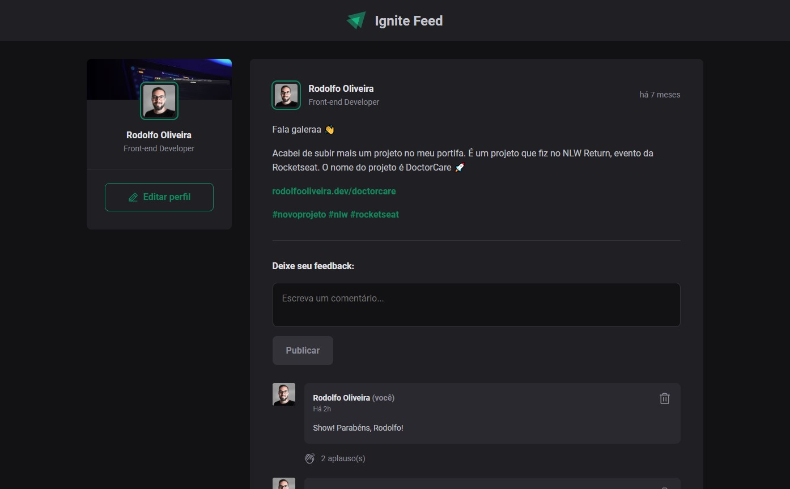

# Ignite Feed App 💻

Aplicação web de rede social para desenvolvedores.

Projeto de estudo sobre os fundamentos do React (Componentes e Propriedades) desenvolvido durante o curso Ignite: Trilha React da Rocketseat.

## :gear: Tech

- ReactJS
- Vite
- JavaScript
- HTML
- CSS

## 👨‍💻 Dev

- [linkedin.com/in/rodolfooliveiram](https://www.linkedin.com/in/rodolfooliveiram/)
